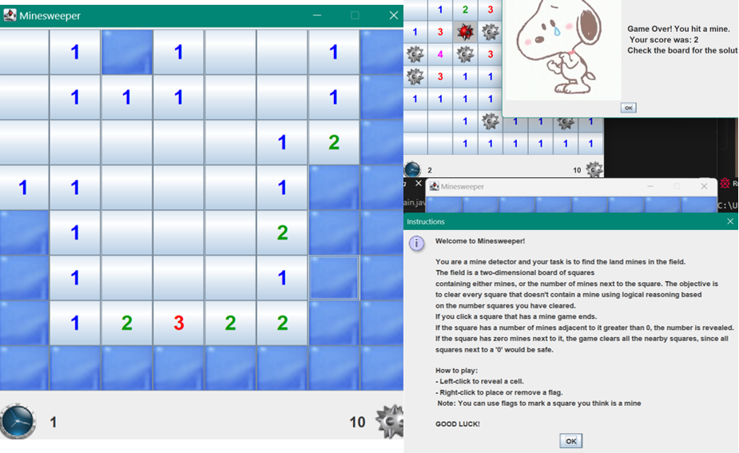

# Minesweeper Recreation in Java

Welcome to the Minesweeper Recreation project! This repository contains a modern re-implementation of the classic Minesweeper game, built entirely in Java. Whether you're a fan of classic games or a developer looking to explore Java programming techniques, this project offers both fun and insights.

---

## 🎮 Features

- **Classic Minesweeper Gameplay**: Enjoy the familiar experience with grid-based gameplay and hidden mines.
- **Interactive UI**: A smooth, user-friendly graphical interface powered by Java's libraries.
- **Game Logic**: Fully implemented logic for flagging, revealing cells, and handling win/lose conditions.
- **Scalable Design**: Easily expandable for future enhancements or adaptations.

---

## 🛠️ Technologies Used

- **Java**: Core language for game logic and application development.
- **Swing/AWT**: For creating the graphical user interface.
- **Object-Oriented Programming**: Modular code structure using OOP principles for maintainability and scalability.

---

## 🚀 Getting Started

### Prerequisites

Ensure you have the following installed:

- [Java Development Kit (JDK)](https://www.oracle.com/java/technologies/javase-jdk11-downloads.html) (version 8 or higher)
- [Git](https://git-scm.com/) (optional, for cloning the repository)

### Installation

1. Clone the repository:
   ```
   git clone https://github.com/ad-TI/MineSweeperGame.git
   cd minesweeper-java
   ```
2. Compile the code:
```javac -d bin src/*.java```
3. Run the game:
```java -cp bin src/Main.java```

## 🎯 How to Play
**Objective**: The field is a two-dimensional board of squares containing either mines, or the number of mines next to the square. The objective is 
to clear every square that doesn't contain a mine using logical reasoning based on the number squares you have cleared.
If you click a square that has a mine game ends.If the square has a number of mines adjacent to it greater than 0, the number is revealed.
If the square has zero mines next to it, the game clears all the nearby squares, since all squares next to a '0' would be safe.

**Controls:**
- Left-click to reveal a cell.
- Right-click to place or remove a flag. Note: You can use flags to mark a square you think is a mine

## Preview
